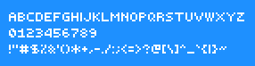

# 复古像素字体 / Retro Pixel Font

一组开源的有怀旧游戏感觉的像素字体。字体基本上以英文、数字和符号为主。

如果您在寻找开源的泛中日韩或 Unicode 像素字体，请尝试 [「方舟像素字体」](https://github.com/TakWolf/ark-pixel-font) 。

这个项目不仅提供了全部的字形源文件，也提供了构建字体所需要的完整程序。

- [主页](https://retro-pixel-font.takwolf.com)
- [itch.io](https://takwolf.itch.io/retro-pixel-font)

## 预览

可以通过 [主页](https://retro-pixel-font.takwolf.com) 实时预览字体效果。

### Arcade

尺寸：8px / 行高：12px · [实时预览](https://retro-pixel-font.takwolf.com#font-arcade) · [字母表](https://retro-pixel-font.takwolf.com/arcade/alphabet.html) · [示例文本](https://retro-pixel-font.takwolf.com/arcade/demo.html)

街机风格的像素字体。设计来源于雅达利和红白机的游戏字体。

### Cute Mono

尺寸：11px / 行高：15px · [实时预览](https://retro-pixel-font.takwolf.com#font-cute-mono) · [字母表](https://retro-pixel-font.takwolf.com/cute-mono/alphabet.html) · [示例文本](https://retro-pixel-font.takwolf.com/cute-mono/demo.html)

以小写字母为 5 像素高作为基础尺寸来设计，等宽模式。

### Cute Prop

尺寸：11px / 行高：15px · [实时预览](https://retro-pixel-font.takwolf.com#font-cute-prop) · [字母表](https://retro-pixel-font.takwolf.com/cute-prop/alphabet.html) · [示例文本](https://retro-pixel-font.takwolf.com/cute-prop/demo.html)

以小写字母为 5 像素高作为基础尺寸来设计，比例模式。

### Petty 5H

尺寸：5px / 行高：9px · [实时预览](https://retro-pixel-font.takwolf.com#font-petty-5h) · [字母表](https://retro-pixel-font.takwolf.com/petty-5h/alphabet.html) · [示例文本](https://retro-pixel-font.takwolf.com/petty-5h/demo.html)

以最小尺寸 5 像素高来绘制大写字母。相应的，只有大写字母和基础标点符号。

### Petty 5x5

尺寸：5px / 行高：9px · [实时预览](https://retro-pixel-font.takwolf.com#font-petty-5x5) · [字母表](https://retro-pixel-font.takwolf.com/petty-5x5/alphabet.html) · [示例文本](https://retro-pixel-font.takwolf.com/petty-5x5/demo.html)

以最小尺寸 5*5 像素来绘制大写字母。相应的，只有大写字母和基础标点符号。

### Thick

尺寸：16px / 行高：20px · [实时预览](https://retro-pixel-font.takwolf.com#font-thick) · [字母表](https://retro-pixel-font.takwolf.com/thick/alphabet.html) · [示例文本](https://retro-pixel-font.takwolf.com/thick/demo.html)

有一点厚重感觉的像素字体。

## 下载和使用

可在 [Releases](https://github.com/TakWolf/retro-pixel-font/releases) 下载最新的版本。

使用时请注意正确地设置渲染尺寸。

## 本地构建

这是一个标准的 [Python3](https://www.python.org) 项目。

当您配置好运行环境后，执行 `python ./build.py` 命令来开始构建。

等待任务完成后，可在 `build/outputs` 目录下找到生成的字体文件。

## 授权信息

分为「字体」和「构建程序」两个部分。

### 字体

使用 [SIL 开放字体许可证第 1.1 版](LICENSE-OFL) 授权。

### 构建程序

使用 [MIT 许可证](LICENSE-MIT) 授权。

## 程序依赖

- [FontTools](https://github.com/fonttools/fonttools)
- [Brotli](https://github.com/google/brotli)
- [Unidata Blocks](https://github.com/TakWolf/unidata-blocks)
- [PyPNG](https://gitlab.com/drj11/pypng)
- [Pillow](https://github.com/python-pillow/Pillow)
- [Beautiful Soup](https://www.crummy.com/software/BeautifulSoup/)
- [Jinja](https://github.com/pallets/jinja)
- [GitPython](https://github.com/gitpython-developers/GitPython)

## 赞助

如果这个项目对您有帮助，请考虑赞助来支持开发工作。

- [收款码](https://github.com/TakWolf/TakWolf/blob/master/payment-qr-codes.md)
- [爱发电](https://afdian.net/@takwolf)

赞助时请留下您的称呼，该信息将会被添加到赞助商列表中。

可以通过下面的链接来查看收到的赞助的具体情况：

[赞助详情](https://github.com/TakWolf/TakWolf/blob/master/sponsors.md)
